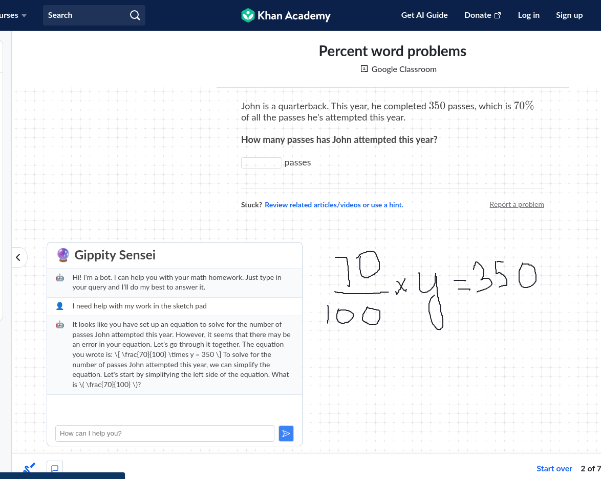

# Gippity Sensei PoC

A PoC to show how learning experiences can be made better on platforms like Khan Academy by making use of all interactions like the sketch pad.

## Credits

This wouldn't have been possible without [chrome-extension-boilerplate-react-vite](https://github.com/Jonghakseo/chrome-extension-boilerplate-react-vite) by [JongHak Seo](https://github.com/Jonghakseo)
